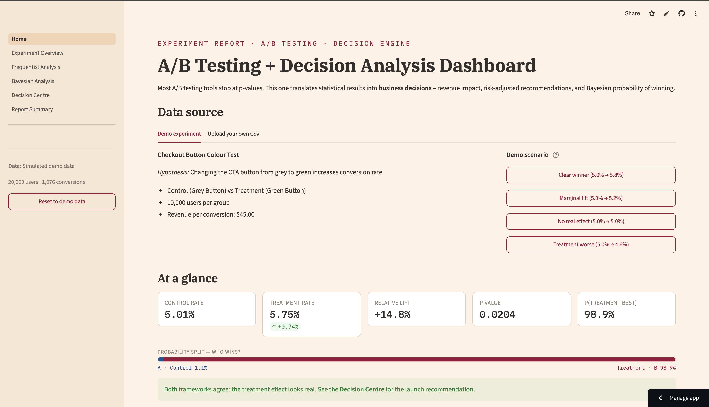
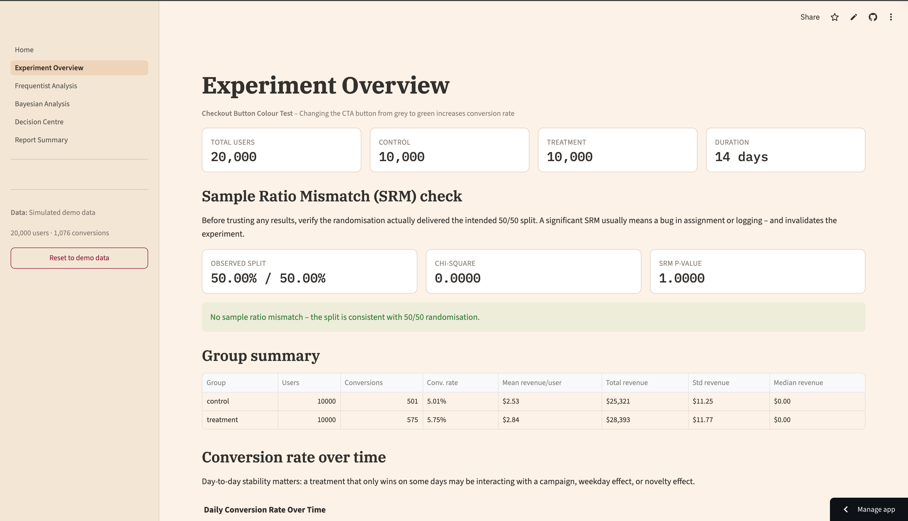
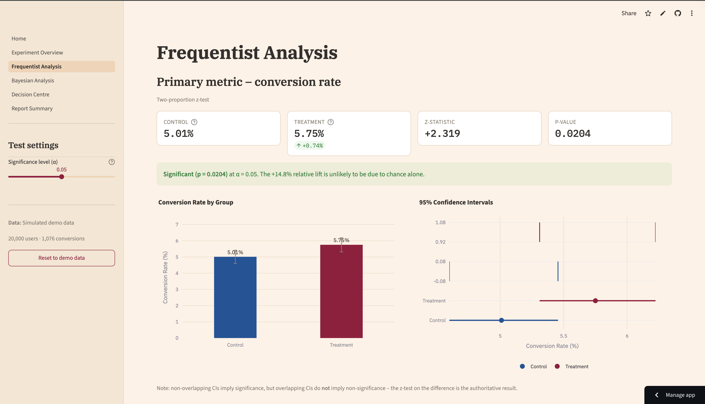
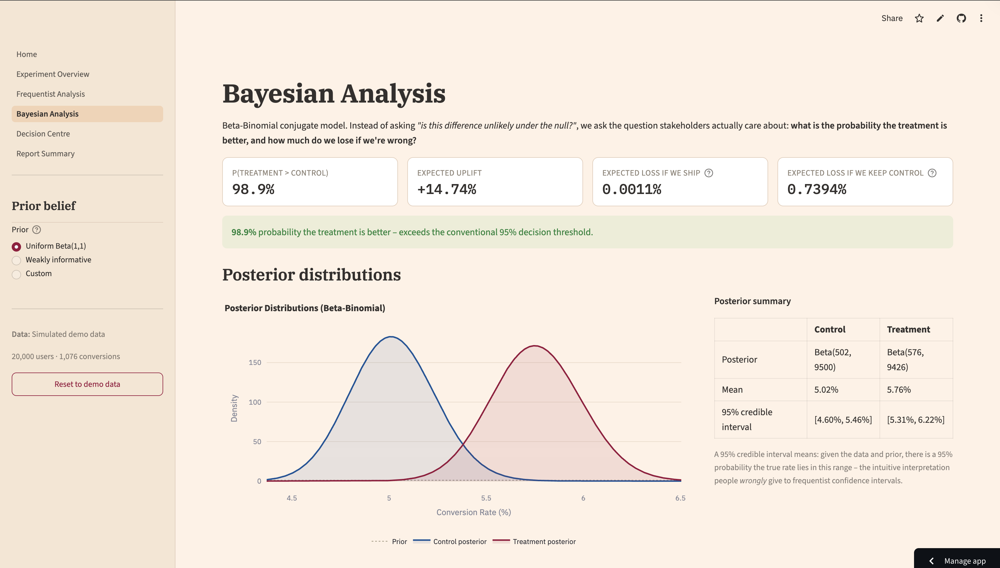
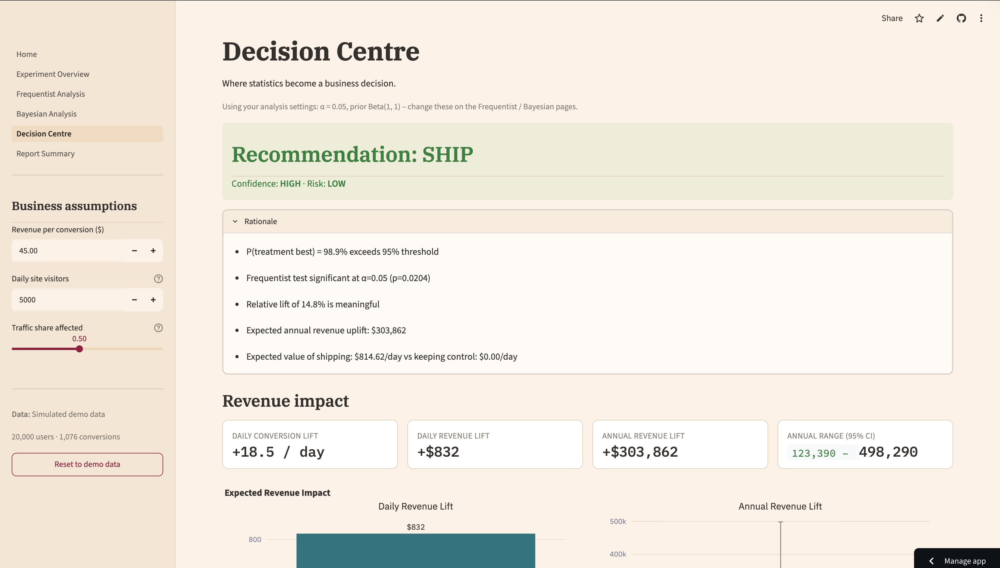

# A/B Testing + Decision Analysis Dashboard

[](https://ab-testing-decision-dashboard.streamlit.app/)


A production-style experimentation platform that combines **Frequentist hypothesis testing**, **Bayesian inference**, and **business impact modelling** to support data-driven product decisions.

Rather than stopping at statistical significance, the dashboard translates experiment results into actionable recommendations through revenue forecasting, risk analysis, scenario modelling, and stakeholder-ready PDF reporting.

### Key Highlights

- Frequentist A/B testing (z-tests, confidence intervals, power analysis)
- Bayesian decision framework (posterior distributions, expected loss, probability of winning)
- Revenue impact and expected value modelling
- Scenario-based business recommendations
- Upload and analyse external A/B testing datasets
- Automated PDF report generation
- Streamlit-based interactive dashboard

### Live Demo

🔗 https://ab-testing-decision-dashboard.streamlit.app/

---

## Dashboard Preview

### Home Dashboard

Provides experiment selection, dataset management, and a high-level overview of the testing workflow.




### Experiment Overview

Validates experiment health before analysis through SRM checks, group summaries, and trend monitoring.




### Frequentist Analysis

Performs classical hypothesis testing using conversion rate comparisons, confidence intervals, and power analysis.




### Bayesian Analysis

Estimates the probability that the treatment is genuinely better and quantifies uncertainty through posterior distributions.




### Decision Centre

Transforms statistical results into business recommendations, revenue forecasts, and risk-adjusted decisions.



---

## Features

### Experiment Overview

- Sample Ratio Mismatch (SRM) validation
- Experiment health checks
- Group-level summaries
- Conversion trends over time
- Device-level segmentation analysis
- Revenue distribution exploration

### Frequentist Analysis

- Two-proportion z-test
- Statistical significance testing
- Confidence intervals
- Effect size measurement
- Power analysis
- Minimum Detectable Effect (MDE) estimation

### Bayesian Analysis

- Beta-Binomial Bayesian modelling
- Posterior distributions
- Probability Treatment > Control
- Expected uplift estimation
- Expected loss calculations
- Bayesian sample size simulation

### Decision Centre

- Business-focused launch recommendations
- Revenue impact projections
- Expected value calculations
- Risk vs reward analysis
- Scenario modelling
- Adjustable business assumptions

### Report Summary

- Executive summary generation
- Stakeholder-friendly reporting
- PDF export
- Markdown export

---

## Generated Reports

The dashboard can export stakeholder-ready PDF reports based on the current experiment, statistical settings, Bayesian prior, and business assumptions.

Example reports included in this repository:

| Report | Scenario | Decision |
|---|---|---|
| [Clear Winner Report](reports/01_Significant_Uplift_SHIP_Decision_Report.pdf) | Treatment clearly improves conversion | SHIP |
| [Marginal Lift Report](reports/02_Inconclusive_Result_Continue_Testing_Report.pdf) | Small positive lift but insufficient evidence | CONTINUE TESTING |
| [Treatment Worse Report](reports/03_Treatment_Worse_Do_Not_Ship_Report.pdf) | Treatment reduces conversion | DO NOT SHIP |
| [Real-World A/B Test Validation](reports/04_Real_World_AB_Test_Validation_Report.pdf) | Uploaded public A/B test dataset | DO NOT SHIP |

These reports demonstrate how the dashboard handles different experiment outcomes: clear wins, inconclusive results, losing treatments, and real-world uploaded datasets.

---

## Real-World Validation

The dashboard was validated using the public Udacity E-Commerce A/B Testing dataset containing over 294,000 user observations.

The platform correctly identified that the treatment variant underperformed the control group and produced a **DO NOT SHIP** recommendation, demonstrating that the decision engine performs reliably on real-world data rather than only synthetic experiments.

---

## Skills Demonstrated

This project demonstrates:

- Experimental Design
- Statistical Hypothesis Testing
- Bayesian Inference
- Decision Analysis
- Product Analytics
- Revenue Forecasting
- Data Visualisation
- Dashboard Development
- Business Communication
- Report Automation
- Python Software Engineering

---

## Tech Stack

| Layer | Tools |
|---|---|
| Language | Python 3.11+ |
| Dashboard | Streamlit |
| Data Processing | pandas, numpy |
| Frequentist Statistics | scipy, statsmodels |
| Bayesian Analysis | scipy.stats |
| Visualisation | Plotly |
| Reporting | reportlab, tabulate |

---

## Project Structure

```
ab-testing-decision-dashboard/
│
├── Home.py
├── requirements.txt
├── README.md
├── .gitignore
│
├── .streamlit/
│   └── config.toml
│
├── data/
│   ├── simulated_ab_test.csv
│   └── experiment_config.json
│
├── src/
│   ├── __init__.py
│   ├── experiment_simulator.py
│   ├── stats_engine.py
│   ├── bayesian_engine.py
│   ├── decision_engine.py
│   └── report_generator.py
│
├── pages/
│   ├── 1_Experiment_Overview.py
│   ├── 2_Frequentist_Analysis.py
│   ├── 3_Bayesian_Analysis.py
│   ├── 4_Decision_Centre.py
│   └── 5_Report_Summary.py
│
├── utils/
│   ├── __init__.py
│   ├── data_loader.py
│   ├── plotting.py
│   ├── formatting.py
│   ├── state.py
│   └── theme.py
│
├── screenshots/
│   ├── 01_home_dashboard.png
│   ├── 02_experiment_overview.png
│   ├── 03_experiment_conversion_rate.png
│   ├── 04_frequentist_analysis.png
│   ├── 05_frequentist_secondary_metric.png
│   ├── 06_bayesian_analysis.png
│   ├── 07_bayesian_uplift.png
│   ├── 08_decision_centre.png
│   ├── 09_decision_risk_reward.png
│   └── 10_report_summary.png
│
└── reports/
│   ├── 01_Significant_Uplift_SHIP_Decision_Report.pdf
│   ├── 02_Inconclusive_Result_Continue_Testing_Report.pdf
│   ├── 03_Treatment_Worse_Do_Not_Ship_Report.pdf
│   └── 04_Real_World_AB_Test_Validation_Report.pdf
```

---

## Business Questions Answered

This dashboard helps answer:

- Is the treatment statistically significant?
- What is the probability the treatment is actually better?
- How much revenue could the change generate?
- What is the downside risk if we launch?
- Do both Frequentist and Bayesian frameworks agree?
- Should the organisation ship the treatment?

---

## Example Outcome

For the included demonstration experiment:

- Control Conversion Rate: 5.01%
- Treatment Conversion Rate: 5.75%
- Relative Lift: +14.8%
- p-value: 0.0204
- P(Treatment Better): 98.9%
- Expected Annual Revenue Impact: +$303,862

### Decision

**SHIP**

- Confidence: HIGH
- Risk Rating: LOW
- Expected Annual Revenue Impact: +$303,862
- P(Treatment Better): 98.9%

---

## Running Locally

```bash
git clone https://github.com/Nihira11/ab-testing-decision-dashboard.git
cd ab-testing-decision-dashboard
pip install -r requirements.txt

# run the dashboard
streamlit run Home.py
```

---

## Future Improvements

Potential extensions to move the platform closer to production-grade experimentation systems:

- Sequential testing support
- CUPED variance reduction
- Multi-armed bandit experimentation
- Automated anomaly detection
- Causal inference extensions
- Real-time experimentation monitoring

---

## Author

Built as an end-to-end experimentation and decision intelligence platform demonstrating statistical analysis, Bayesian modelling, business analytics, and dashboard engineering


